<p align="center">
  
</p>

<p align="center"><strong>Version 1.00</strong></p>

**Automatic gate control for a robot mower.** Gateduino watches for a Mammotion
Luba mower over Bluetooth and automatically opens an automatic gate as the mower
approaches, then closes it once the mower has driven through — so the mower can
move between zones on its schedule without leaving the gate open.

The intelligence is **on the devices**, not in a server. Three ESP32 nodes
detect the mower over BLE, coordinate over ESP-NOW (a direct radio link, no
router or broker), and the gate node runs the whole open/close decision itself.
Home Assistant is used only for the dashboard, manual control, and tuning — if
HA, WiFi, or the network are down, the gate still works.

Note, I built an original project as MQTT based version of this solution, Claude Code
assisted in the rewrite to ESPHome and documentation of the setup process. 
Please keep in mind additional validation of the install process is needed.

<p align="center">
  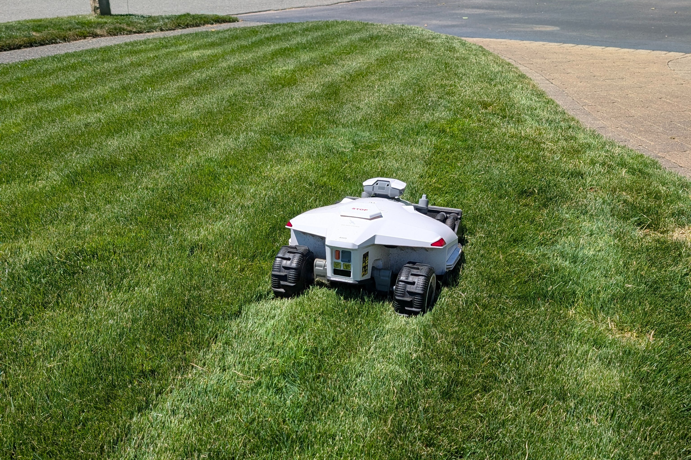
</p>

---

## Why I built this

Most robot-mower gate solutions I found wanted me to **cut into the gate**. That 
doesn't work for a vinyl fence. I needed to keep the gate closed as well since we
have a dog. I was stuck so I wanted to solve this with a fun technical project.

Gateduino uses a robot mowers bluetooth signature to detect it's location. 
The gate opens just for the pass-through, and it closes right behind the mower.
No cutting into the gate. Home Assistant is used as a dashboard and supports
the ESP32 Nodes with ESPHome.

Happy mowing. 🐕🌱

---

## How it works

```
[front node]                       [back node]
 BLE scan, front yard               BLE scan, back yard
 sends TRIGGER on approach          sends TRIGGER on approach
        \                                  /
         \-------- ESP-NOW broadcast ------/     (peer-to-peer, no WiFi needed)
                          |
                   [gate node]
                    BLE scan + gate relay (1 GPIO)
                    runs the transit state machine
                          |
                    ESPHome native API
                          |
                   [Home Assistant]   (dashboard / manual / tuning only)
```

- Each scanner node measures the mower's BLE signal strength (RSSI). When the
  mower gets close enough (configurable `Trigger RSSI`), the node fires a
  one-shot **TRIGGER** to the gate over ESP-NOW.
- The gate node opens, then runs a small **transit state machine**. The first
  node to fire is the "entry" side and opens the gate *tentatively* (**armed**).
  The crossing is **confirmed** the moment the mower actually reaches the gate
  (the gate's own RSSI crosses `Trigger RSSI`) or the opposite ("exit") scanner
  fires — reaching the far node proves the mower drove through. Once confirmed,
  the gate **closes as soon as the mower leaves**: its own RSSI drops below
  `Clear RSSI` (a hysteresis threshold a few dB below `Trigger RSSI`, so it never
  closes on the mower mid-crossing), or the exit node was reached. So a front→back
  pass closes right after the mower clears the back of the gate, instead of
  waiting out a fixed timer.
- **False-trip guard:** if the gate opens but the mower never actually reaches it
  within `Arm Timeout` — e.g. the mower is just mowing near a scanner and trips it
  without intending to cross — the open is **aborted** and the gate closes, then a
  cooldown blocks an immediate re-open from the same lingering mower.
- A `Max Hold` backstop force-closes after a hard cap, so reflections or a mower
  parked in range can never latch the gate open.
- If the mower's battery dies or its Bluetooth drops while in range, the RSSI
  reading is forced to "no signal" after `rssi_timeout` instead of latching the
  last value — so a stalled mower can't hold the gate open indefinitely.
- Invalid (non-finite) RSSI readings are rejected before they can fire a
  trigger, so a momentary sensor glitch can't spuriously open the gate.

---

## Bill of materials

These are the exact parts used in this build. Amazon links are affiliate links;
substitute equivalents freely.

**Compute & radio (the three nodes)**

| Qty | Item | Role |
|-----|------|------|
| 1× 3-pack | [Seeed Studio XIAO ESP32-S3 (3-pack)](https://amzn.to/4fFGfLJ) | One board per node — front, back, gate. |
| 3 | [2.4 GHz 6 dBi RP-SMA antenna](https://amzn.to/4aPXV3R) (sold in 2-packs) | External antenna per node for BLE/WiFi range. |

**Gate hardware**

| Qty | Item | Role |
|-----|------|------|
| 1 | [Automatic gate opener, aluminium alloy](https://amzn.to/4vKIrWO) | The gate actuator the gate node drives. |
| 1 | [AGPtek electric magnetic lock, 60 kg / 130 lb](https://amzn.to/4uC5GSb) | Holds the gate shut while closed. |
| 1 | Relay / opto module (or the XIAO GPIO direct) | Gate node only — drives the opener/lock trigger. |

**Power**

| Qty | Item | Role |
|-----|------|------|
| 3 | [DC 12 V/24 V → 5 V USB-C step-down, 5 A / 25 W](https://amzn.to/4uBlKn9) | Powers each XIAO from the gate supply. |
| 1 | [THIRDREALITY Smart Plug Gen3, 15 A, real-time power monitoring](https://amzn.to/4fFGdDB) | Switched + metered mains feed for the gate/opener. |

**Enclosures**

| Qty | Item | Role |
|-----|------|------|
| 2 | [NDS 107BC 6 in. valve box + cover](https://amzn.to/4xrjbqv) | In-ground housing for the front & back yard scanners (flush with the lawn). |
| 3 | [Small weatherproof connection box](https://amzn.to/4xiY89o) | Sealed box for each node (two scanners + the gate node on the post). |
| 1 | [Outdoor waterproof junction box](https://amzn.to/4fKA20Z) | Under-deck power box — 24 V PSU, converters, smart plug. |
| — | Wiring, connectors, fixings | As needed for your runs. |

**Manual control (optional)**

| Qty | Item | Role |
|-----|------|------|
| 1 | [Philips Hue wireless smart button](https://amzn.to/3Sm3PDu) | Physical open/close, bound to the gate via Home Assistant. |

> **Quantities marked here are this build's bill of materials.** A few enclosure
> counts depend on how many outdoor nodes you box up and where you site them.

### Seeed XIAO ESP32-S3

<p align="center">
  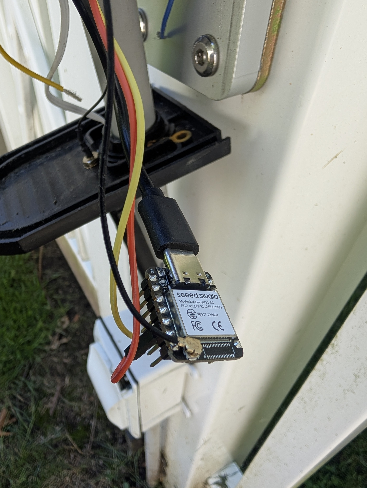
</p>

Thumb-sized ESP32-S3 board (dual-core 240 MHz, WiFi + BLE 5, 8 MB flash). Chosen
for its tiny footprint and, importantly, its **external u.FL antenna** — BLE
range to the mower matters, and the external antenna gives noticeably better
reception than a PCB antenna when the node is sealed inside a box. Each node runs
off a 24 V→5 V converter into the board's USB-C port (above: a node wired up
inside its enclosure, antenna pigtail attached).

ESPHome board id used in this project: `seeed_xiao_esp32s3`. Pin labels on the
board (D0–D10) **do not** equal the raw GPIO numbers — the only one this project
uses is **D4 = GPIO5** for the gate relay.

### Moonshan MS-GO-1 gate opener

<p align="center">
  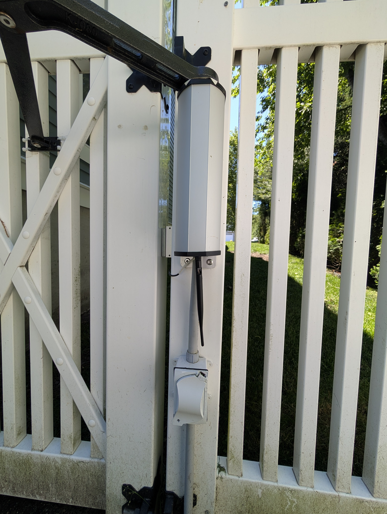
  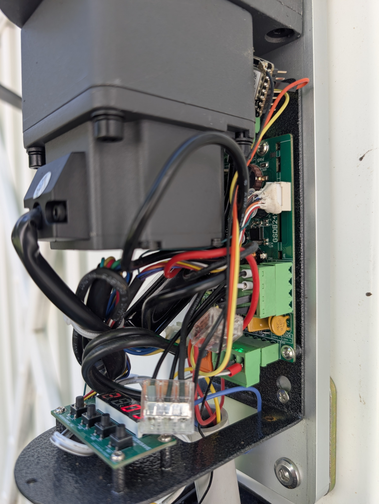
</p>

A **Moonshan MS-GO-1** automatic opener swings the gate; its own controller board
(right) handles the motor and limits and exposes a low-voltage **trigger /
hold-open input**. The gate node drives only that trigger input through one GPIO
(see [Wiring](#wiring)) — it never touches the motor. The opener is fed from a
24 V supply in the under-deck power box.

> The MS-GO-1 uses a level-held "hold-open" trigger: this firmware holds the relay
> **closed while the gate should be open** and releases it to close. If you adapt
> this to an opener that expects a momentary toggle pulse, the `gate_relay`
> handling needs a small change.

### Electric lock — to beat the wind

<p align="center">
  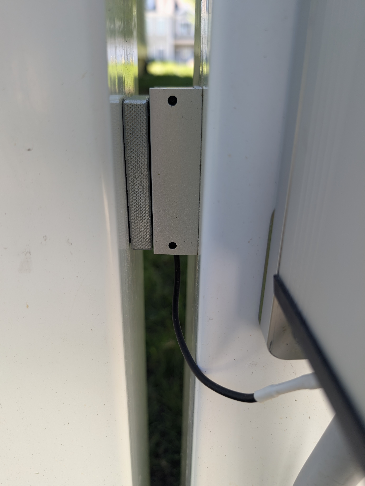
</p>

The gate would get **blown ajar in high wind** — a small gap, but enough to defeat
the "keep the dog in" goal. So I added an **electric lock** at the gate's leading
edge that holds it positively shut when closed and releases when it opens. It's an
add-on for *this* gate's wind problem; if your gate latches solidly on its own you
may not need one.

### Power — one box under the deck

<p align="center">
  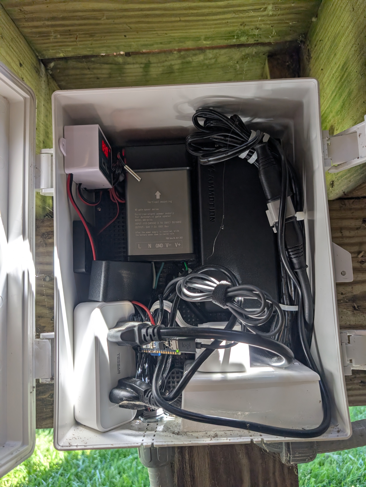
  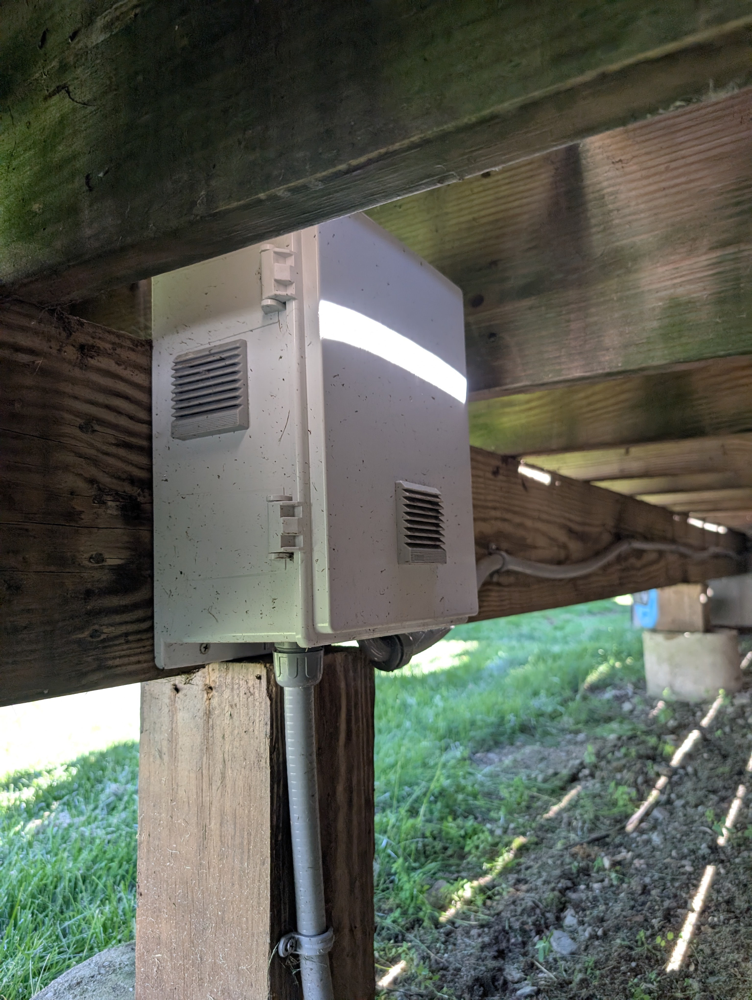
</p>

A single vented weatherproof junction box under the deck holds the mains side: the
**gate opener's 24 V power supply**, the **24 V→5 V USB-C converters**, and a
**metered smart plug** so the whole gate system's power draw is visible in Home
Assistant (and can be cut remotely). A small inline voltage display makes the 24 V
rail easy to eyeball. From here the **low-voltage 24 V is run underground in
direct-burial landscaping wire** out to each node, where a local converter steps it
down to 5 V — no mains anywhere but this one box.

---

## Wiring

The **only** signal wire from a Gateduino node is the gate relay on the gate node
— the front and back scanners are wireless (ESP-NOW) and connect to nothing on the
gate but their own power.

| Gate node pin | Connects to |
|---------------|-------------|
| **GPIO5 (XIAO D4)**, active-low | MS-GO-1 **trigger / hold-open** input (via relay or opto) |
| 5 V / GND | 24 V→5 V converter output (from the buried 24 V run) |

The XIAO only ever asserts that one line — the opener handles the motor and limits,
and the **electric lock is a separate device** that holds the gate shut against
wind.

`active-low` means the firmware pulls the pin low to open. Use a relay or
opto-isolator rated for the opener's trigger input rather than driving it directly
from the GPIO.

---

## The physical install

A tour of the actual deployment — a white vinyl yard gate with the mower passing
between the front and back lawns.

### Scanner nodes — flush in the lawn

The front and back scanners each live in a weatherproof box dropped into an
**in-ground irrigation valve box**, flush with the grass and out of the mower's
way, each with a clear line of sight to the gate. Inside: a XIAO ESP32-S3, a
24 V→5 V converter, and the 6 dBi external antenna. Power reaches them as **24 V on
direct-burial landscaping wire** run underground from the under-deck box — no mains
or batteries at the nodes.

<p align="center">
  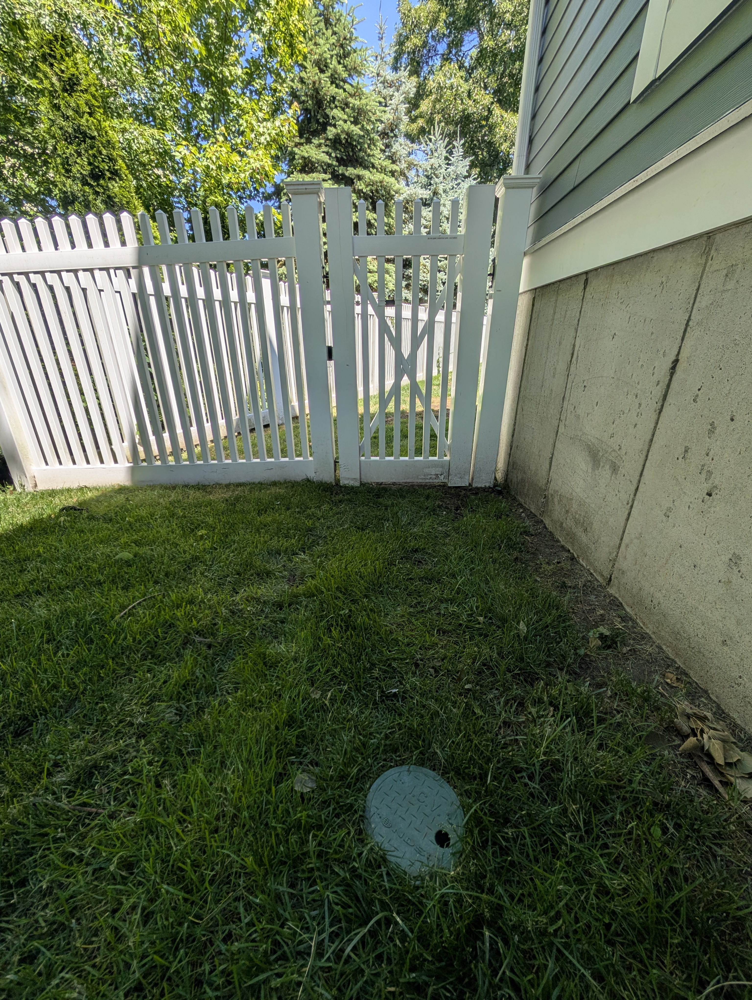
  
</p>
<p align="center"><em>Each scanner's view of the gate (its valve-box lid in the foreground) — front yard, left; back yard, right.</em></p>

<p align="center">
  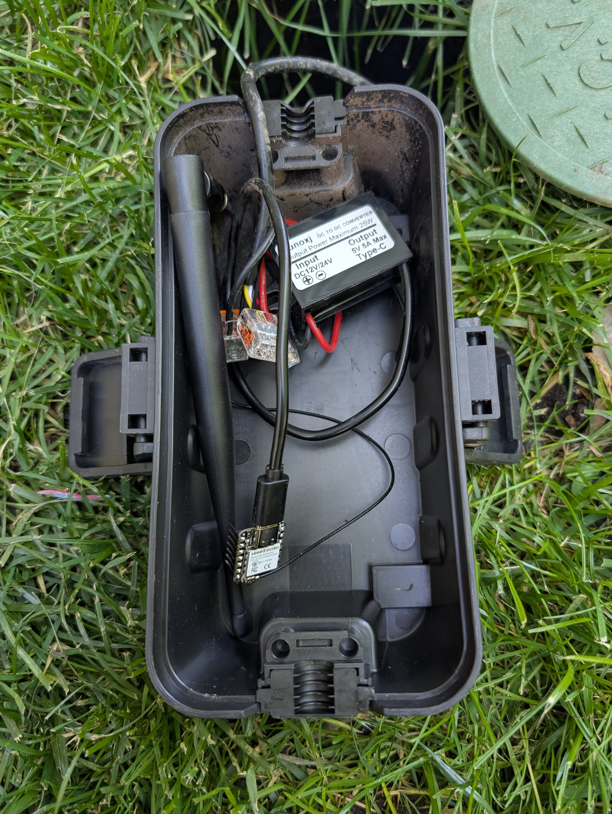
  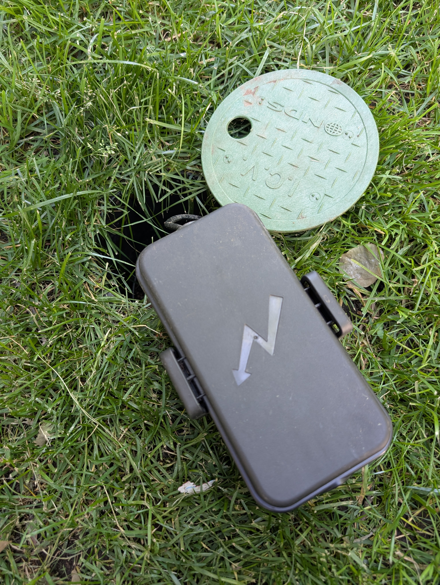
</p>
<p align="center"><em>A scanner node and its antenna in a sealed box that drops into the green valve-box cover.</em></p>

### At the gate

The gate node sits in a weatherproof box on the gate post next to the opener, with
its antenna outside the box. Manual control lives here too: a **weatherproof
cut-off switch** to kill the automation, and a **Philips Hue wireless button** for
a quick manual open/close — both bound to the gate through Home Assistant.

<p align="center">
  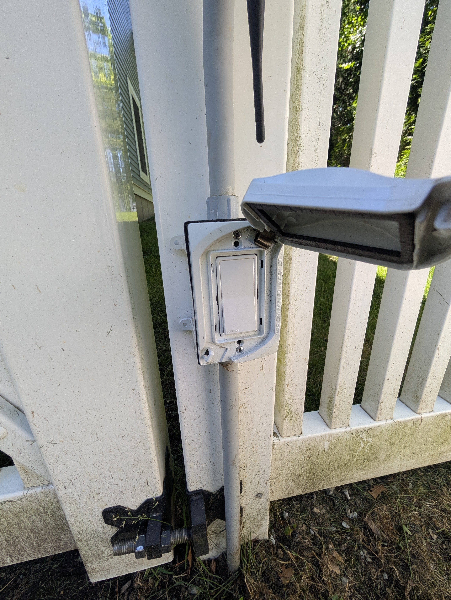
  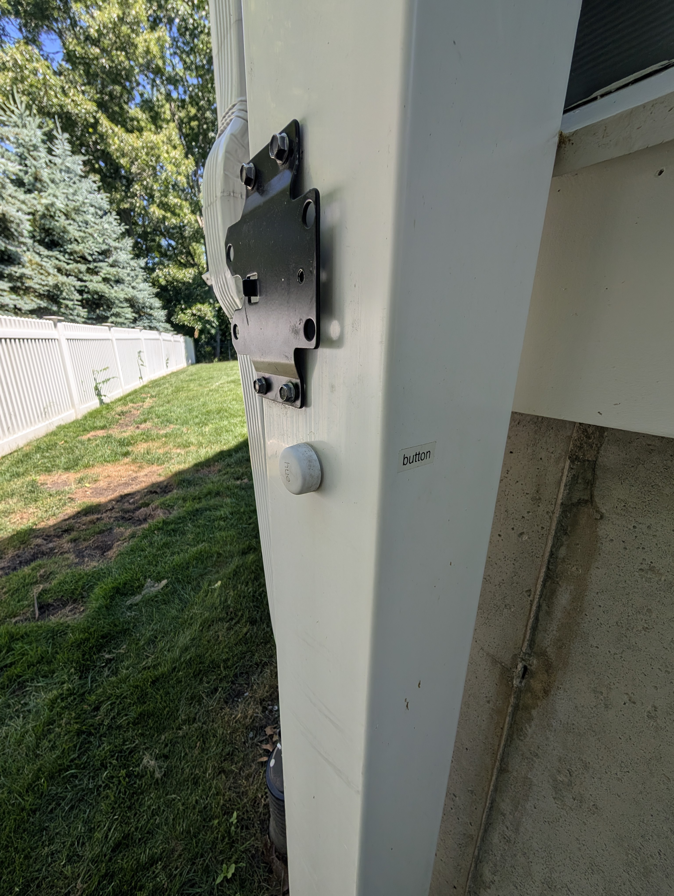
</p>
<p align="center"><em>Manual cut-off switch (left) and the Hue button (right) on the gate post.</em></p>

### Watch it work

▶ **[Transit video](docs/images/transit_video.mp4)** — the mower approaches, the
gate unlocks and opens just for the pass-through, then closes and re-locks right
behind it.

---

## Firmware install

Built with [ESPHome](https://esphome.io). You need ESPHome installed
(`pip install esphome`) and the [secrets file](#1-secrets) filled in.

### 1. Configure your install (`secrets.yaml`)

```bash
cp esphome/secrets.yaml.example esphome/secrets.yaml
```

`esphome/secrets.yaml` is **gitignored** — your credentials are never committed.
Fill in every value:

| Secret | What it is |
|--------|------------|
| `wifi_ssid` / `wifi_password` | Your **2.4 GHz** WiFi (the XIAO is 2.4 GHz only). |
| `luba_mac` | Your mower's **BLE MAC** — how every node identifies the mower. |
| `ota_password` | Password for over-the-air firmware updates. **Set your own.** |
| `fallback_password` | Password for each node's fallback hotspot. **Set your own.** |
| `api_key_front` / `_back` / `_gate` | One native-API encryption key per node. |

Generate the three API keys:
```bash
esphome generate-api-key   # run 3× → api_key_front / api_key_back / api_key_gate
```

**Finding your mower's BLE MAC:** scan with a phone BLE app (e.g. nRF Connect),
or flash a node and watch its logs with `BLE Scanning` on. The **MAC** (not the
BLE name) is used because the mower stops advertising its name once a Bluetooth
proxy connects. It's bound at compile time, so changing `luba_mac` later needs a
reflash.

### 2. First flash (USB, once per node)

The factory partition table is too small to OTA the full firmware directly, so
the first flash is over USB:

1. Plug the XIAO into a computer running Chrome.
2. Go to **https://web.esphome.io** → **Connect** → install the prepared
   ESP32-S3 base image and enter your WiFi.
3. From a machine with this repo, push the real config over the air:
   ```bash
   cd esphome
   esphome run gateduino-front.yaml --device 192.168.0.200
   esphome run gateduino-back.yaml  --device 192.168.0.250
   esphome run gateduino-gate.yaml  --device <gate-ip>
   ```

Flash the **front and back** nodes first (they're scanners; the gate stays
closed), then the **gate** node. After the first USB flash, all future updates
are OTA: `esphome run gateduino-<node>.yaml`.

### 3. Static IPs (set for your own network)

The example configs give the **front** and **back** scanners static IPs
(`192.168.0.200` / `192.168.0.250`) so OTA always finds them; the **gate** node
uses DHCP. **These IPs are just examples** — edit the `manual_ip` block (plus
`gateway` / `subnet`) in `gateduino-front.yaml` and `gateduino-back.yaml` to fit
your LAN, then use those addresses in the `--device` flags above. If your network
resolves mDNS you can also just use `gateduino-front.local`, etc.

---

## Home Assistant

The nodes connect to HA over the **native ESPHome API** (no MQTT). Add each via
**Settings → Devices & Services → ESPHome**, using its IP and API key.

Import the included dashboard at
[`ha/gateduino-dashboard.yaml`](ha/gateduino-dashboard.yaml):
**Settings → Dashboards → + Add dashboard → Edit in YAML → paste.** You get:

- a **live RSSI graph** of all three nodes,
- a **streaming Activity log** (the gate's decisions in the HA logbook),
- gate **controls** (Momentary Open, Hold Open, Auto Mode, raw relay),
- and all **tuning** sliders.

### Manual control

Every control is also exposed as an ESPHome entity/service, so you can drive the
gate from HA, automations, or another hub (e.g. Hubitat via the HA bridge):

- **Momentary Open** — open now and auto-close after `Manual Open Duration`
  seconds. Available as the *Momentary Open* button and the `open_gate` service.
  If **Hold Open** is engaged, pressing Momentary instead **cancels the hold and
  closes** the gate — so the button acts as a toggle while held.
- **Hold Open** — keep the gate open indefinitely until released; mower-proximity
  triggers are ignored while it's on. Turn it off (or press Momentary) to close.
- **Gate** — the raw relay switch; the `close_gate` service force-closes.
- **Auto Mode** — disarm to lock out auto-open while leaving the gate **closed**
  (e.g. while a Bluetooth proxy is using the mower, or during maintenance).

For end-to-end testing without the mower, each scanner has a **Test Trigger**
diagnostic button that fires a real ESP-NOW trigger. ⚠️ It physically actuates
the gate — it is **not** a dry run. To exercise the radio without moving the
gate, turn `Auto Mode` off first.

---

## Configuration — live-editable in HA (no reflash)

| Entity | Nodes | Meaning |
|--------|-------|---------|
| `Trigger RSSI` | all | dBm; mower this close to a node ⇒ trigger the gate |
| `Area RSSI` | all | dBm; approach threshold (dashboard zone marker) |
| `Transit Timeout` | all | s; scanner re-fire lockout (between successive triggers from one node) |
| `Clear RSSI` | gate | dBm; once a crossing is confirmed, gate closes when its own RSSI drops below this (hysteresis below `Trigger RSSI`) |
| `Arm Timeout` | gate | s; false-trip guard — mower must reach the gate within this after opening, or the open is aborted |
| `Max Hold` | gate | s; hard cap on open time per crossing (backstop against stuck-high RSSI) |
| `Child Cooldown` | gate | s; backstop window after a trigger is accepted |
| `Manual Open Duration` | gate | s; how long Momentary Open stays open before auto-closing |
| `BLE Scanning` | all | enable/disable mower detection |
| `Auto Mode` | gate | disarm to lock out auto-open (gate stays closed) |
| `Hold Open` | gate | keep gate open until released; ignores triggers while on |
| `Activity` | all | last event (streams to HA logbook) |
| `Crossing Active` / `Entry Side` | gate | transit state-machine diagnostics |

`rssi_timeout` (stale-signal decay, default 15 s) is a build-time constant in
`esphome/common.yaml` — ESPHome filter timeouts aren't runtime-settable.

### Tuning the thresholds

RSSI is negative dBm and **closer = higher** (−70 is closer than −85). Start from
the defaults and adjust on the live RSSI graph as the mower drives up to a node:

- **`Trigger RSSI`** (default −76) — how close the mower must be to a scanner
  before it fires the gate. Too high (e.g. −60) → the gate opens late, only when
  the mower is right at the node; too low (e.g. −90) → it opens from far away or
  on stray reflections. Drive the mower to the spot where you want the gate to
  *start* opening, read the RSSI there, and set `Trigger RSSI` to it.
- **`Area RSSI`** (default −87) — a looser "approaching" threshold used only as a
  dashboard zone marker; keep it a bit lower (farther) than `Trigger RSSI`.
- **`Clear RSSI`** (gate, default −83) — once a crossing is confirmed, the gate
  closes when its **own** RSSI falls below this. It's a hysteresis floor: keep it
  a few dB **below** `Trigger RSSI` (−76) so the mower lingering right at the gate
  can't trip a premature close. Closer to `Trigger RSSI` → closes sooner (mower
  barely clear); lower (e.g. −88) → waits until the mower is well away. Watch the
  gate's live RSSI as the mower drives clear and set this to the value it reads
  just after it's past.
- **`Arm Timeout`** (gate, default 12 s) — the false-trip guard. After the gate
  opens, the mower has this long to actually reach the gate (confirm the crossing)
  before the open is aborted and closed. Set it a bit longer than the slowest
  real approach from a scanner to the gate; too short → real-but-slow approaches
  get aborted, too long → a false trip holds the gate open longer before giving up.
- **`Max Hold`** (gate, default 30 s) — hard cap on how long the gate stays open
  for one crossing. A pure backstop; it should be comfortably longer than a normal
  confirmed crossing takes.
- **`Transit Timeout`** (default 10 s) — the per-scanner re-fire lockout: how long
  a scanner waits before it can send another trigger. (It no longer gates the
  gate's close — the close is RSSI/exit-driven now.)
- **`Child Cooldown`** (gate, default 30 s) — backstop window that ignores repeat
  triggers right after one is accepted, so a single crossing is de-bounced; also
  the lockout applied after a false-trip abort.
- **`Manual Open Duration`** (gate, default 15 s) — how long *Momentary Open*
  holds before auto-closing.

---

## Home Assistant blueprints (optional)

The gate runs its open/close logic **on-device**, so it works with no HA
automations at all. These optional blueprints (in
[`blueprints/automation/gateduino/`](blueprints/automation/gateduino)) add
HA-side conveniences on top:

| Blueprint | What it does |
|-----------|--------------|
| **Auto Open** (`auto_open.yaml`) | HA-side open when the mower is `mowing` and approaching — an alternative/backup to the on-device auto-open; checks an enable-toggle and optional BLE-proxy conditions first. |
| **Auto Close — Mower Gone** (`auto_close_rssi.yaml`) | Close once all scanners stay below `Area RSSI` for a delay. |
| **Auto Close — Mower Docked** (`auto_close_docked.yaml`) | Close shortly after the mower returns to its dock. |

### Deploy a blueprint

Home Assistant imports blueprints straight from a GitHub URL — **no HACS needed.**
Easiest is the one-click import links:

- [Import **Auto Open**](https://my.home-assistant.io/redirect/blueprint_import/?blueprint_url=https%3A%2F%2Fgithub.com%2Fwavezcs%2Fgateduino%2Fblob%2Fmain%2Fblueprints%2Fautomation%2Fgateduino%2Fauto_open.yaml)
- [Import **Auto Close — Mower Gone**](https://my.home-assistant.io/redirect/blueprint_import/?blueprint_url=https%3A%2F%2Fgithub.com%2Fwavezcs%2Fgateduino%2Fblob%2Fmain%2Fblueprints%2Fautomation%2Fgateduino%2Fauto_close_rssi.yaml)
- [Import **Auto Close — Mower Docked**](https://my.home-assistant.io/redirect/blueprint_import/?blueprint_url=https%3A%2F%2Fgithub.com%2Fwavezcs%2Fgateduino%2Fblob%2Fmain%2Fblueprints%2Fautomation%2Fgateduino%2Fauto_close_docked.yaml)

Or manually: **Settings → Automations & Scenes → Blueprints → Import Blueprint**
and paste the raw file URL, e.g.
`https://github.com/wavezcs/gateduino/blob/main/blueprints/automation/gateduino/auto_open.yaml`.

After importing, **create an automation** from the blueprint and select your
entities (mower, gate switch, scanner RSSI sensors). The **Auto Open** blueprint
also needs an `input_boolean.gate_auto_open_enabled` helper as its master toggle.

### HACS

This repo ships a `hacs.json`, so it can be added under **HACS → ⋮ → Custom
repositories** for discovery and update notifications. Note that HACS does **not**
flash ESPHome firmware or natively install blueprints — flash the firmware with
ESPHome (above) and add the blueprints with HA's built-in **Import Blueprint**
(also above). HACS is therefore optional here; the import links are the simplest
path.

---

## Repo layout

```
esphome/
  common.yaml            shared base (WiFi, BLE, ESP-NOW, HA entities)
  gateduino-front.yaml   front scanner   (node_id 1)
  gateduino-back.yaml    back scanner    (node_id 2)
  gateduino-gate.yaml    gate controller (relay + transit state machine)
  secrets.yaml.example   template for your secrets
ha/
  gateduino-dashboard.yaml   Home Assistant dashboard
blueprints/automation/gateduino/   optional HA blueprints (auto open/close)
docs/images/             photos referenced by this README
```

---

## Security & limitations

Gateduino drives a **physical gate**, so it's worth being clear about the trust model:

- **ESP-NOW triggers are intentionally unauthenticated.** Scanner → gate TRIGGER
  packets are plain ESP-NOW broadcasts validated only by a magic byte and length —
  **not encrypted or signed, by design**. This is a deliberate choice for this
  application: a backyard gate isn't a meaningful security boundary in the first
  place — anyone standing next to it can hop it or just push the manual release —
  so encrypting a short-range radio trigger that only opens that gate buys nothing
  and adds key management across three nodes. In theory someone with an ESP32
  within radio range could forge a trigger; in practice they're already at the
  gate they could open by hand. If you ever repurpose this for something that
  *does* need authentication, ESPHome supports [ESP-NOW
  encryption](https://esphome.io/components/espnow/) (shared key on all three
  nodes, drop `auto_add_peer`).
- **WiFi / OTA / API are credential-protected.** WiFi password, OTA password,
  fallback-hotspot password, and a per-node native-API encryption key all live in
  `secrets.yaml` (gitignored). Set strong, unique values — the
  `secrets.yaml.example` placeholders (`CHANGE_ME_*`) are intentionally invalid.
- **The mower BLE MAC is not a secret.** It's broadcast over the air; it lives in
  `secrets.yaml` only to keep it out of the repo, not because it's sensitive.
- **`logger` runs at `DEBUG`.** Device logs include the mower MAC and live RSSI.
  Lower the log level in `common.yaml` if that console is exposed.

---

## Credits / history

Originally an Arduino sketch with the gate logic on the nodes; briefly moved to
Home-Assistant-side automations; now back to **on-device** logic over ESP-NOW
(the best of both — autonomous like the original, wireless and HA-observable).
